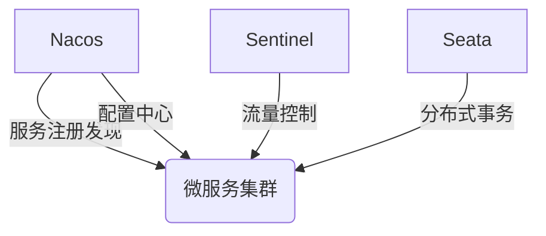
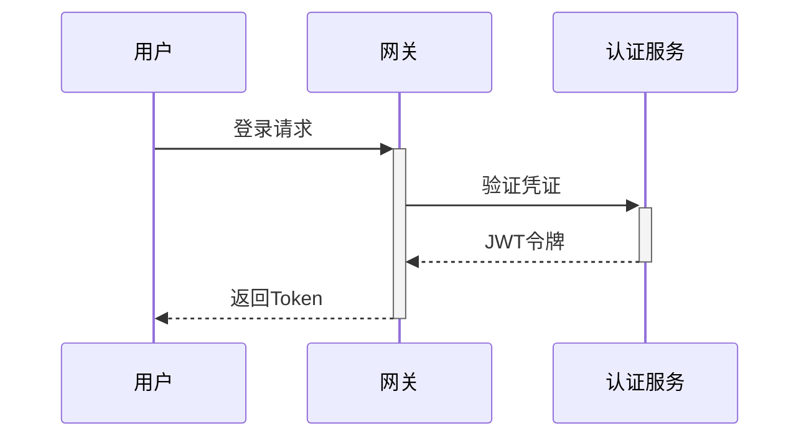

# 微服务电商平台（Spring Cloud版）

## 📌 项目概述
基于Spring Cloud Alibaba的分布式电商系统，采用微服务架构解决传统单体应用在高并发场景下的扩展性问题。

## 🛠️ 技术栈

### 核心框架
| 技术                   | 用途                     | 版本         |
|----------------------|--------------------------|------------|
| Spring Boot          | 基础开发框架             | 2.7.12     |
| Spring Cloud         | 微服务解决方案           | 2021.0.8   |
| Spring Cloud Alibaba | 阿里微服务生态集成       | 2021.0.5.0 |
| Mybatis              | mybatis plus       | 2021.0.5.0 |

### 基础设施

### 基础设施

