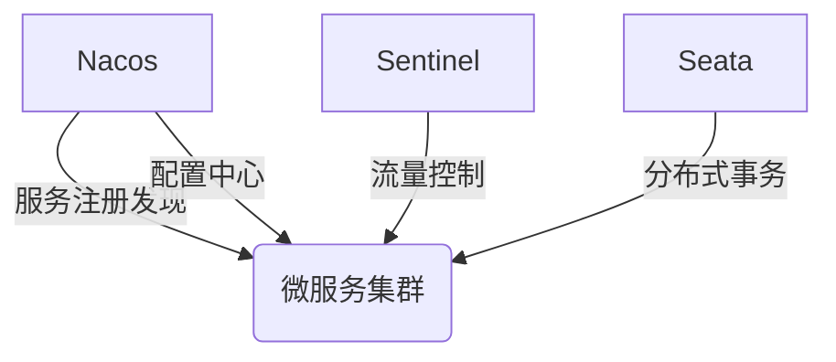
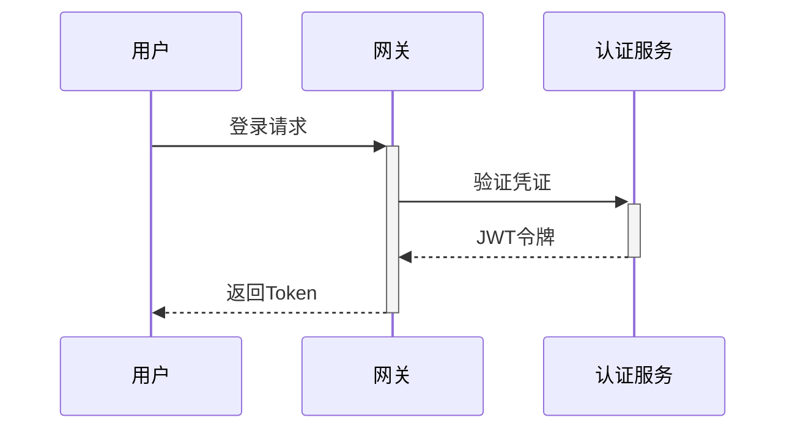

# 微服务电商平台（Spring Cloud）

## 📌 项目概述
该项目以黑马商城为基础拓展功能， 
基于Spring Cloud Alibaba的分布式电商系统，，采用微服务架构解决传统单体应用在高并发场景下的扩展性问题。

## 项目文档
[https://b11et3un53m.feishu.cn/wiki/FYNkwb1i6i0qwCk7lF2caEq5nRe](https://b11et3un53m.feishu.cn/wiki/FYNkwb1i6i0qwCk7lF2caEq5nRe)


## 项目介绍
### 组织结构
``` lua
mall
├── cart-service -- 工具类及通用代码
├── item-service -- MyBatisGenerator生成的数据库操作代码
├── trade-service -- SpringSecurity封装公用模块
├── pay-service -- 后台商城管理系统接口
├── user-service -- 用户管理模块
├── hm-common -- 通用模块
|── hm-api -- openFeign服务调用
└── hm-gateway -- 网关模块
```

### 🛠️ 技术栈

#### 技术选型
| 技术                   | 说明        |
|----------------------|-----------|
| Spring Boot          | 基础开发框架    |
| Spring Cloud         | 微服务解决方案   |
| Spring Cloud Alibaba | 阿里微服务生态集成 |
| Mybatis Plus         | ORM框架     |
| RabbitMQ             | 消息队列      |
| Redis                | 分布式缓存     |
| openFeign            | 微服务间调用    |
| Sentinel             | 微服务保护     |
| Seata                | 分布式事务     |
| gateway              | 网关        |
| MySql                | 关系型数据库    |
| JWT                  | JWT登录支持   |
| Hutool               | Java工具类库  |
| Lombok               | Java语言增强库 |

#### 架构图 

### 基础设施


### 前端 & SQL文件地址
[网盘分享的文件：mall-project](https://pan.baidu.com/s/1fiZiN8Q7ynU9m9g_dVkyeQ?pwd=i3r8)
或者[前端代码仓库](https://github.com/viencess/mall-project.git)
    
